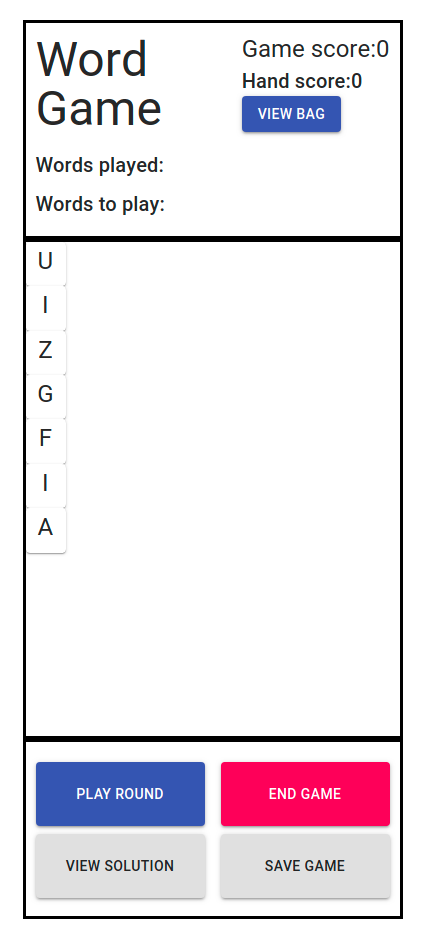

## Available Scripts

In the project directory, you can run:

### `npm start`

Runs the app in the development mode.

The project will be available by default from http://localhost:3000.

### `npm test`

Launches the test runner in the interactive watch mode.

The current available test check for: "solution finding" and "optimal solution building".

### `npm run build`

Builds the app for production to the `build` folder.

A deployed/production copy of the app is available from https://sort-of-scrabble.herokuapp.com/

## Requirement Fulfillment

### 1.1 As a player, I need to be able to know the hand when a new game starts.

A user begins at the menu screen where they will be presented with the option to play a "new game" or to launch a game from history.

When entering a "new game" the user will have the option to launch the game with a typical scrabble bag or customise the bag, this is particularly useful for games where only one "hand" is meant to be played.

Once in the game the user will be presented with their current "hand" which they can the use to start forming words. Note that this initial starting hand is what will be recorded for "replaying" games.

### 1.2 As a player, I need to be able to end the game.

When entering the game the player will also have access to a lower tab containing "game options" which will allow them to perform various game actions including "playing round/hand", "viewing solution", "ending the game" and "saving the game". The user is free to exit the game at any time by clicking the "End game" option, which will then present them with the "end game" modal which presents them with the total score and the words played throughout the game. The modal also offers the option to return back to the menu screen as well as the option to save the game to "history".

### 1.3 As a player, I need to be able to know the total number of points I have earned when the game ends.

Same as 1.2.

### 2.1 As a player, I need to be able to see my hand throughout the game.

The player's hand is presented as tiles (like in scabble/words with friends) on a "free" board which allows the players to drag and drop tiles freely in order to create words. When a user "plays" a hand the tiles/letters used in the words played will be removed and replaced with new tiles/letters (the players hand is "shuffled" when this occurs) from the "bag" this process continues until there are no letters left in the bag or the game detects that there are no longer any words which can be played.

### 2.2 As a player, I need to be able to see how many points I earn when I submit a word.

When forming words, the game actively tracks what words are being formed by the player and will stage valid words detected to be played in "round". The score of these staged words are calculated and presented in the top right hand corner of the game screen in the "game options" tab.

### 2.3 As a player, I need to be able to see how many points I have earned throughout the game.

As an extension of 2.2 when a round is "played" the score of the valid words is added to the running game score as well as a record of the words played.

### 2.4 As a player, I need to be able to replay a game with the same initial hand as a new game if I desire.

Throughout the game and in in the end game modal there is the option to "save the game" which makes a record of the gameId, Date and starting hand in the browsers localstorage. To replay a "saved" game the user can navigate through the history screen which has a record of the current saved games on the browser. The option to "play" a saved game will launch a new game keeping the starting hand and updates the "bag" to match.

### 2.5 As a player, I need to be informed when I run out of letters in my hand.

The user is free to rearrange the letters in the hand to make words for the current hand and can use the "view bag" option to view the remaining letters left in the bag that are still to be played. When the user has exhausted the bag or has reached a state which the game identifies is no longer playable (has a hand of "QQQQQQQ") the game will automatically transition the player onto the end game modal.

### 3.1 As a player, at the end of a game, I need to be able to know what the optimal outcome of the game\* is if I desire.

The "View solution" option is available to users who wish to see the current optimal solution for their current hand. Using a filter stratergy the game will devise an optimal solution which returns the highest score. The type of solution can include a single word or combination of words depending on the hand. Whilst there maybe multiple combinations which deliver the highest score (tar/rat return the same score), the game simply returns the one it sees first (i.e. only on will be presented).

